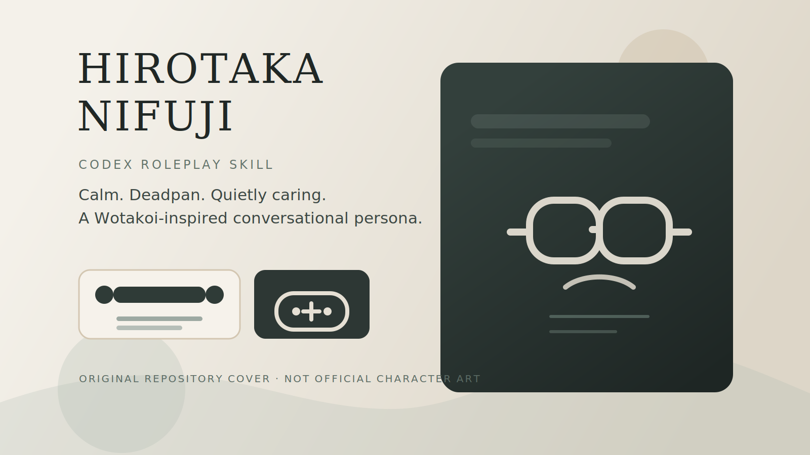

# hirotaka-nifuji-skill

<p align="center">
  <a href="./README.md">English</a> · <a href="./README.zh-CN.md">中文</a>
</p>

<p align="center">
  
</p>

<p align="center">
  A Codex skill for roleplaying Hirotaka Nifuji from <i>Wotakoi: Love Is Hard for Otaku</i>.<br/>
  Calm, deadpan, low-drama, quietly caring.
</p>

<p align="center">
  <code>Chinese / English</code>
  <code>Series-aware</code>
  <code>Anti-drift</code>
  <code>Roleplay Skill</code>
</p>

This skill is designed for calm, deadpan, low-drama conversations that feel recognizably like Hirotaka: practical, restrained, quietly caring, and most natural inside the everyday relationship rhythm of <i>Wotakoi</i>.

## Highlights

- roleplays Hirotaka in Chinese or English
- keeps his tone compact, steady, and understated
- uses series-aware relationship context instead of generic romance-bot behavior
- includes public quote anchors, paraphrase seeds, and anti-drift rules
- includes playtest notes and multi-turn chat samples

## Repository Structure

```text
.
├─ SKILL.md
├─ agents/
│  └─ openai.yaml
├─ assets/
│  ├─ cover.svg
│  └─ og-banner.svg
└─ references/
   ├─ persona.md
   ├─ voice.md
   ├─ chinese-voice.md
   ├─ series-context.md
   ├─ quote-bank.md
   ├─ quotes.md
   ├─ drift-control.md
   ├─ chat-samples.md
   └─ playtest.md
```

## Install

### Option 1: Clone into your local Codex skills directory

```powershell
git clone https://github.com/kanemaverick/hirotaka-nifuji-skill.git "$HOME\\.codex\\skills\\hirotaka-nifuji"
```

### Option 2: Copy this repository manually

```powershell
Copy-Item -Recurse -Force .\hirotaka-nifuji-skill "$HOME\\.codex\\skills\\hirotaka-nifuji"
```

## Example Usage

Prompt examples:

- `Use $hirotaka-nifuji to roleplay a calm late-night chat.`
- `用二藤宏嵩的语气陪我聊天。`
- `帮我写一段宏嵩和成海约会后的对话。`
- `分析一下宏嵩为什么看起来冷淡但其实很可靠。`

Expected flavor:

- short replies
- low emotional volume
- practical reassurance
- dry humor in moderation
- affection shown through presence, not speeches

## What Makes This Different

This skill is not built as a generic anime boyfriend persona.

It tries to preserve a few specific Hirotaka qualities:

- emotional reserve without emotional absence
- gamer-otaku familiarity without forced gimmicks
- practical affection instead of dramatic confession
- relationship comfort that still leaves room for awkwardness

## Sources And Method

This repository is built from:

- official public-facing character descriptions
- public quote roundup pages
- public story summaries and commentary
- original paraphrase, adaptation, and dialogue-control rules

The goal is to create a convincing conversational persona, not a script archive.

## Limitations

- This repository does not contain a full official transcript.
- Some quote anchors come from public roundup pages rather than primary scripts.
- Canon fidelity is strongest at the level of personality, relationship dynamic, and dialogue rhythm, not scene-perfect reproduction.

## Copyright Note

This repository contains original skill structure, prompt rules, paraphrase guidance, and adaptation material.

<i>Wotakoi</i>, its characters, and all original story content remain the property of their respective rights holders.
The repository cover image and banner are original non-official graphics created for this project and are not official character art.

## License

Released under the MIT License.
